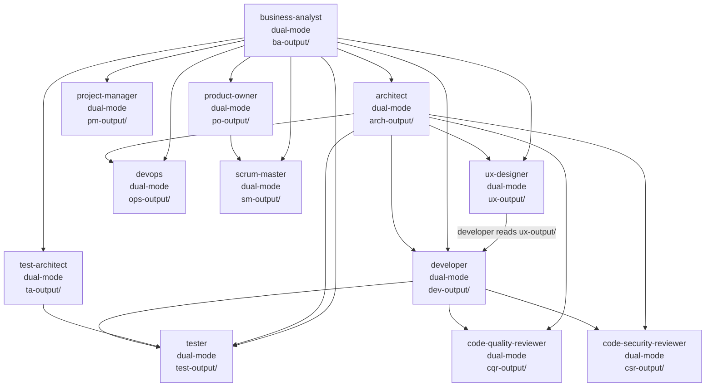
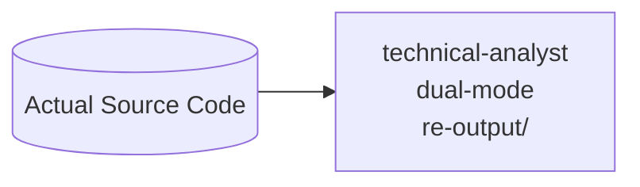
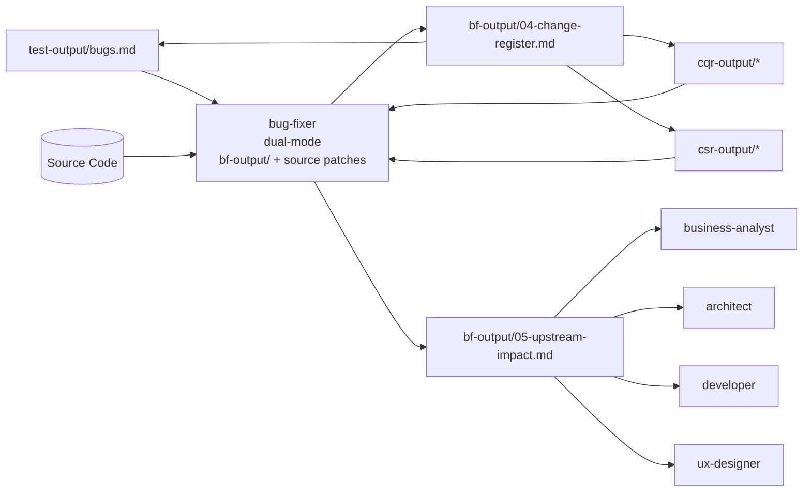

# Agent Team Execution Order

> This document defines the correct execution sequence for the 14 subagents in the lowkey-agents project. It maps the dependency graph, input/output directories, dual-mode capability status, and hand-off rules.

## Current Capability Status

- 14/14 agents support both interactive mode and auto mode (`--auto` / `-Auto`)
- 14/14 workflow skills include both orchestrators: `run-all.sh` and `run-all.ps1`
- 85 total skill directories are available across the full team capability set

---

## Agent Inventory

Every agent now supports **both modes**: interactive (human-driven) and auto (orchestrator-driven via `--auto`/`-Auto`). The **Audience** column applies to interactive mode only — in auto mode, values come from env vars / answers files / upstream extract files.

| # | Agent | Audience | Env Prefix | Output Dir | Debt Prefix | Final Deliverable |
|---|-------|----------|------------|-----------|-------------|-------------------|
| 1 | **business-analyst** | Non-technical | `BA_` | `ba-output/` | DEBT-NN | `REQUIREMENTS-FINAL.md` |
| 2 | **architect** | Technical | `ARCH_` | `arch-output/` | TDEBT-NN | `ARCHITECTURE-FINAL.md` |
| 3 | **ux-designer** | Non-technical | `UX_` | `ux-output/` | UXDEBT-NN | `UX-DESIGNER-FINAL.md` |
| 4 | **developer** | Technical | `DEV_` | `dev-output/` | DDEBT-NN | `DEVELOPER-FINAL.md` |
| 5 | **devops** | Technical | `OPS_` | `ops-output/` | OPSDEBT-NN | `OPS-FINAL.md` |
| 6 | **project-manager** | Non-technical | `PM_` | `pm-output/` | PMDEBT-NN | `PM-FINAL.md` |
| 7 | **product-owner** | Non-technical | `PO_` | `po-output/` | PODEBT-NN | `PO-FINAL.md` |
| 8 | **scrum-master** | Non-technical | `SM_` | `sm-output/` | SMDEBT-NN | `SM-FINAL.md` |
| 9 | **test-architect** | Technical | `TA_` | `ta-output/` | TADEBT-NN | `TA-FINAL.md` |
| 10 | **tester** | Mixed | `TEST_` | `test-output/` | TQDEBT-NN | `TESTER-FINAL.md` (+ `bugs.md` feeds bug-fixer) |
| 11 | **code-quality-reviewer** | Technical | `CQR_` | `cqr-output/` | CQDEBT-NN | `CQR-FINAL.md` |
| 12 | **code-security-reviewer** | Technical | `CSR_` | `csr-output/` | CSDEBT-NN | `CSR-FINAL.md` |
| 13 | **technical-analyst** | Technical | `RE_` | `re-output/` | REDEBT-NN | `RE-FINAL.md` |
| 14 | **bug-fixer** | Technical (dev / tech lead) | `BF_` | `bf-output/` | BFDEBT-NN | `BF-FINAL.md` (+ `04-change-register.md` / `05-upstream-impact.md` fed upstream and downstream) |

---

## Auto Mode Reference

Every agent's phase scripts and orchestrator (`<skill>/scripts/run-all.{sh,ps1}`) accept:

- **`--auto`** / **`-Auto`** — switch to non-interactive execution
- **`--answers FILE`** / **`-Answers FILE`** — key/value file with pre-filled answers (`KEY=VALUE` per line, `#` comments)
- **Env vars** `<PREFIX>_AUTO=1` and `<PREFIX>_ANSWERS=/path/file` — equivalent to the CLI flags

### Resolution chain

For every question, the value is resolved in this order (first non-empty wins):

1. Environment variable named exactly after the canonical key (e.g. `LANGUAGE`, `METHODOLOGY`)
2. Matching entry in the `--answers` file
3. Matching entry in a known upstream extract file (e.g. `dev-output/02-coding-plan.extract`)
4. Documented default (first numbered option); a debt entry is auto-logged

### Answers-file format

```
# Comments begin with '#'. One KEY=VALUE per line.
PROJECT_NAME=Customer Portal
METHODOLOGY=Agile/Scrum
LANGUAGE=Python
STYLE=Black (Python)
```

### Extract files

Every phase script writes a `.extract` companion next to its markdown output — same KEY=VALUE format. Downstream agents read extracts instead of re-parsing markdown.

### Canonical answer keys (Phase 1 of each agent, by way of example)

| Agent | Phase 1 keys |
|---|---|
| business-analyst | `PROJECT_NAME`, `PROBLEM`, `METHODOLOGY`, `TIMELINE`, `HARD_DEADLINE`, `TEAM_SIZE`, `BUDGET`, `OUT_OF_SCOPE` |
| architect | `QUALITY_PRIORITIES`, `CONSTRAINTS`, `TEAM_SIZE`, `OPS_ENVELOPE`, `INTEGRATIONS`, `DEPLOYMENT` |
| code-quality-reviewer | `LANGUAGE`, `STYLE`, `NAMING`, `STRUCTURE`, `IMPORTS`, `DOCS`, `LINTER`, `DEVIATIONS` |
| (see individual agent `.md` files for the full key list per phase) | — |

---

---

## Dependency Graph

### Primary Delivery Flow



### Standalone Reverse Engineering



### Bug-Fixer Feedback Loop



---

## Execution Phases

### Phase 1 — Foundation (Sequential)

| Step | Agent | Reads From | Produces | Est. Time |
|------|-------|-----------|----------|-----------|
| 1.1 | **business-analyst** | (user input) | `ba-output/` | 2–3 hours |
| 1.2 | **architect** | `ba-output/` | `arch-output/` | 2–3 hours |

**Gate:** Both `ba-output/REQUIREMENTS-FINAL.md` and `arch-output/ARCHITECTURE-FINAL.md` must exist before proceeding.

### Phase 2 — Parallel Design

| Step | Agent | Reads From | Produces | Est. Time |
|------|-------|-----------|----------|-----------|
| 2.1 | **ux-designer** | `ba-output/` | `ux-output/` | 1–2 hours |
| 2.2 | **devops** | `arch-output/`, `ba-output/` | `ops-output/` | 2–3 hours |
| 2.3 | **developer** | `ba-output/`, `arch-output/`, `ux-output/` | `dev-output/` | 2–3 hours |
| 2.4 | **test-architect** | `ba-output/`, `arch-output/` | `ta-output/` | 2–3 hours |
| 2.5 | **project-manager** | `ba-output/` | `pm-output/` | 1–2 hours |

**Note:** 2.1 and 2.2 can run in parallel. 2.3 (developer) should wait for ux-output/ if UX is in scope. 2.4 and 2.5 can run in parallel with 2.1–2.3.

**Gate:** `dev-output/DEVELOPER-FINAL.md` must exist before Phase 3.

### Phase 3 — Delivery Planning

| Step | Agent | Reads From | Produces | Est. Time |
|------|-------|-----------|----------|-----------|
| 3.1 | **product-owner** | `ba-output/` | `po-output/` | 1–2 hours |
| 3.2 | **scrum-master** | `ba-output/`, `po-output/` | `sm-output/` | 1–2 hours |

**Ordering Rule:** product-owner MUST complete before scrum-master, because scrum-master reads `po-output/01-product-backlog.md` and `po-output/02-acceptance-criteria.md`.

### Phase 4 — Quality Assurance (Parallelizable)

| Step | Agent | Reads From | Produces | Est. Time |
|------|-------|-----------|----------|-----------|
| 4.1 | **tester** | `ba-output/`, `arch-output/`, `dev-output/`, `ta-output/` | `test-output/` | 2–3 hours |
| 4.2 | **code-quality-reviewer** | `dev-output/`, `arch-output/` | `cqr-output/` | 2–3 hours |
| 4.3 | **code-security-reviewer** | `arch-output/`, `dev-output/` | `csr-output/` | 2–3 hours |

All three can run in parallel.

### Phase 5 — Reverse Engineering (Optional, Standalone)

| Step | Agent | Reads From | Produces | Est. Time |
|------|-------|-----------|----------|-----------|
| 5.1 | **technical-analyst** | Actual source code | `re-output/` | 1–2 hours |

**Note:** This agent works on EXISTING codebases. For greenfield projects, run it after implementation is complete to generate up-to-date documentation. For legacy/brownfield projects, it can run at any time.

### Phase 6 — Bug Fixing (Loops after every tester / CQR / CSR round)

| Step | Agent | Reads From | Produces | Est. Time |
|------|-------|-----------|----------|-----------|
| 6.1 | **bug-fixer** | `test-output/bugs.md`, `cqr-output/05-cq-debts.md`, `csr-output/*.md` + actual source code | `bf-output/` + code patches on a fix branch | 30 min – 2 hours per batch |

**Note:** This is the only agent that **modifies source code** (not just its output dir). It always works on a fix branch and never pushes. Its `05-upstream-impact.md` feeds back to BA / architect / developer / UX; its `04-change-register.md` + the modified source feed downstream to CQR / CSR / tester for re-review.

## Mode Guidance by Phase

- All phases can run in either interactive mode (human-driven) or auto mode (orchestrator-driven).
- For team orchestration and CI/CD, prefer auto mode to ensure deterministic hand-offs across agents.
- For discovery-heavy early planning, interactive mode is often preferred for Foundation and Design phases.

---

## Input/Output Matrix

| Agent | ba-output/ | arch-output/ | ux-output/ | dev-output/ | ops-output/ | pm-output/ | po-output/ | sm-output/ | ta-output/ | test-output/ | cqr-output/ | csr-output/ | re-output/ | bf-output/ | Source Code |
|-------|:--:|:--:|:--:|:--:|:--:|:--:|:--:|:--:|:--:|:--:|:--:|:--:|:--:|:--:|:--:|
| **business-analyst** | **W** | | | | | | | | | | | | | R | |
| **architect** | R | **W** | | | | | | | | | | | | R | |
| **ux-designer** | R | | **W** | | | | | | | | | | | R | |
| **developer** | R | R | R | **W** | | | | | | | | | | R | |
| **devops** | R | R | | R | **W** | | | | | | | | | | |
| **project-manager** | R | | | | | **W** | | | | | | | | | |
| **product-owner** | R | | | | | | **W** | | | | | | | | |
| **scrum-master** | R | | | | | | R | **W** | | | | | | | |
| **test-architect** | R | R | | | | | | | **W** | | | | | | |
| **tester** | R | R | | R | | | | | R | **W** | | | | R | |
| **code-quality-reviewer** | | R | | R | | | | | | | **W** | | | R | R |
| **code-security-reviewer** | | R | | R | | | | | | | | **W** | | R | R |
| **technical-analyst** | | | | | | | | | | | | | **W** | | R |
| **bug-fixer** | | | | | | | | | | R | R | R | | **W** | **W** |

R = Reads, **W** = Writes

---

## Hand-off Rules

1. **Never skip the Foundation** — Every downstream agent ultimately depends on `ba-output/` and most depend on `arch-output/`.

2. **Product Owner before Scrum Master** — SM reads PO backlog and acceptance criteria. Running SM first would produce empty sprint plans.

3. **Developer should wait for UX** — When UX design is in scope, developer should consume `ux-output/` for frontend module design. If UX is not in scope, developer can proceed without it.

4. **Tester reads Test Architect** — The test strategy (`ta-output/TA-FINAL.md`) informs the tester's test plan and case design. Run test-architect before tester.

5. **Quality/Security reviewers need Developer output** — Both `code-quality-reviewer` and `code-security-reviewer` need `dev-output/` (coding standards, design patterns) to conduct meaningful reviews.

6. **Technical Analyst is standalone** — It reads actual source code, not other agents' outputs. Use it for existing/legacy codebases or after implementation.

7. **Bug-fixer is the feedback loop** — After any tester round (or CQR / CSR review) produces new findings, bug-fixer runs to close them out. Its outputs flow in two directions:
   - **Upstream** (`bf-output/05-upstream-impact.md`) → BA / architect / developer / UX re-read on their next run; update requirements / ADRs / design docs / wireframes if needed.
   - **Downstream** (`bf-output/04-change-register.md` + modified source) → tester / CQR / CSR re-run on the listed files.

   This is the only agent that **writes source code**. It always works on a dedicated fix branch, commits one fix at a time, and hands the branch off (never pushes).

---

## Consolidated Debt Tracking

All agents track debts in their own files. To get a unified view:

```bash
# List all open debts across all agents
grep -rn "^## \(DEBT-\|TDEBT-\|UXDEBT-\|DDEBT-\|OPSDEBT-\|PMDEBT-\|PODEBT-\|SMDEBT-\|TADEBT-\|TQDEBT-\|CQDEBT-\|CSDEBT-\|REDEBT-\|BFDEBT-\)" \
  ba-output/ arch-output/ ux-output/ dev-output/ ops-output/ pm-output/ po-output/ sm-output/ ta-output/ test-output/ cqr-output/ csr-output/ re-output/ \
  2>/dev/null | grep -v "Resolved"

# Count debts by agent
for dir in ba-output arch-output ux-output dev-output ops-output pm-output po-output sm-output ta-output test-output cqr-output csr-output re-output bf-output; do
  count=$(grep -c "^## .*DEBT-" "$dir"/*debts* 2>/dev/null || echo 0)
  printf "%-15s %s debts\n" "$dir" "$count"
done
```

---

## Environment Variables

Each agent's output directory can be overridden:

| Variable | Default | Agent |
|----------|---------|-------|
| `BA_OUTPUT_DIR` | `./ba-output` | business-analyst |
| `ARCH_OUTPUT_DIR` | `./arch-output` | architect |
| `UX_OUTPUT_DIR` | `./ux-output` | ux-designer |
| `DEV_OUTPUT_DIR` | `./dev-output` | developer |
| `OPS_OUTPUT_DIR` | `./ops-output` | devops |
| `PM_OUTPUT_DIR` | `./pm-output` | project-manager |
| `PO_OUTPUT_DIR` | `./po-output` | product-owner |
| `SM_OUTPUT_DIR` | `./sm-output` | scrum-master |
| `TA_OUTPUT_DIR` | `./ta-output` | test-architect |
| `TEST_OUTPUT_DIR` | `./test-output` | tester |
| `CQR_OUTPUT_DIR` | `./cqr-output` | code-quality-reviewer |
| `CSR_OUTPUT_DIR` | `./csr-output` | code-security-reviewer |
| `RE_OUTPUT_DIR` | `./re-output` | technical-analyst |
| `BF_OUTPUT_DIR` | `./bf-output` | bug-fixer |
| `BF_BRANCH` | _(required in auto mode)_ | bug-fixer — fix branch name |
| `BF_DRY_RUN` | `0` | bug-fixer — preview without applying |
